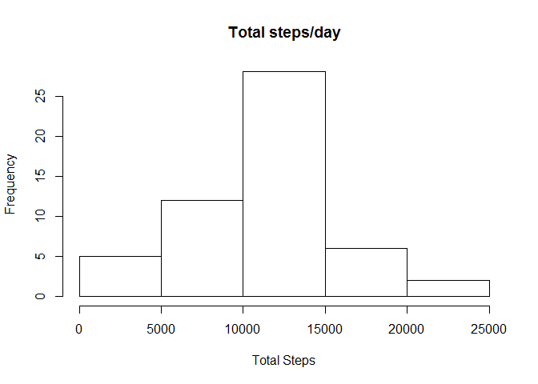
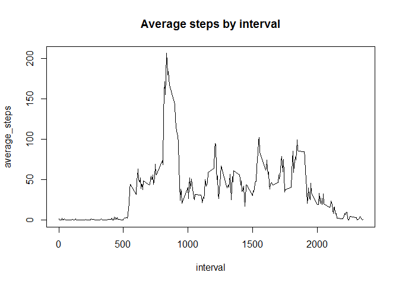
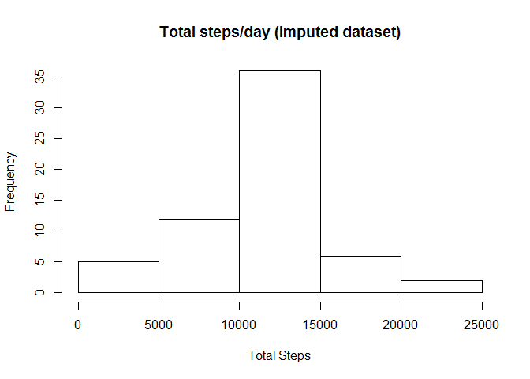
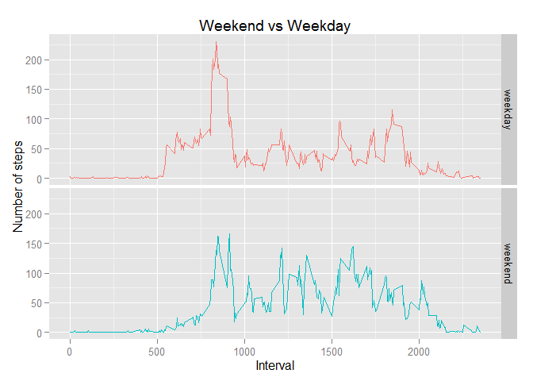

# Reproducible Research: Peer Assessment 1
Bill Kimler  
October 14, 2015  
Required libraries:

```r
library(knitr)
```

```
## Warning: package 'knitr' was built under R version 3.2.2
```

```r
library(dplyr)
```

```
## 
## Attaching package: 'dplyr'
## 
## The following objects are masked from 'package:stats':
## 
##     filter, lag
## 
## The following objects are masked from 'package:base':
## 
##     intersect, setdiff, setequal, union
```

```r
library(ggplot2)
```

Seting the global knitr options:

```r
opts_chunk$set(echo = TRUE)
```

## Loading and preprocessing the data

```r
activity <- read.csv("activity.csv", stringsAsFactors = FALSE)
activity$date <- as.Date(activity$date)
summary(activity)
```

```
##      steps             date               interval     
##  Min.   :  0.00   Min.   :2012-10-01   Min.   :   0.0  
##  1st Qu.:  0.00   1st Qu.:2012-10-16   1st Qu.: 588.8  
##  Median :  0.00   Median :2012-10-31   Median :1177.5  
##  Mean   : 37.38   Mean   :2012-10-31   Mean   :1177.5  
##  3rd Qu.: 12.00   3rd Qu.:2012-11-15   3rd Qu.:1766.2  
##  Max.   :806.00   Max.   :2012-11-30   Max.   :2355.0  
##  NA's   :2304
```

Noticing a large number of of NA's, I decided to look further into it.

```r
nas <- activity[is.na(activity$steps),]
table(nas$date)
```

```
## 
## 2012-10-01 2012-10-08 2012-11-01 2012-11-04 2012-11-09 2012-11-10 
##        288        288        288        288        288        288 
## 2012-11-14 2012-11-30 
##        288        288
```

So it seems as if there were days where all 288 measurements were not recorded. As a result, I felt it was safe to drop all NA values from the dataset.


```r
activity <- activity[!is.na(activity$steps),]
summary(activity)
```

```
##      steps             date               interval     
##  Min.   :  0.00   Min.   :2012-10-02   Min.   :   0.0  
##  1st Qu.:  0.00   1st Qu.:2012-10-16   1st Qu.: 588.8  
##  Median :  0.00   Median :2012-10-29   Median :1177.5  
##  Mean   : 37.38   Mean   :2012-10-30   Mean   :1177.5  
##  3rd Qu.: 12.00   3rd Qu.:2012-11-16   3rd Qu.:1766.2  
##  Max.   :806.00   Max.   :2012-11-29   Max.   :2355.0
```

```r
str(activity)
```

```
## 'data.frame':	15264 obs. of  3 variables:
##  $ steps   : int  0 0 0 0 0 0 0 0 0 0 ...
##  $ date    : Date, format: "2012-10-02" "2012-10-02" ...
##  $ interval: int  0 5 10 15 20 25 30 35 40 45 ...
```


## What is mean total number of steps taken per day?


```r
total_steps_by_date <- summarize(group_by(activity, date), sum(steps))
names(total_steps_by_date) <- c("date", "total_steps")
hist(total_steps_by_date$total_steps, 
     xlab = "Total Steps",
     main = "Total steps/day")
```

 

```r
summary(total_steps_by_date)
```

```
##       date             total_steps   
##  Min.   :2012-10-02   Min.   :   41  
##  1st Qu.:2012-10-16   1st Qu.: 8841  
##  Median :2012-10-29   Median :10765  
##  Mean   :2012-10-30   Mean   :10766  
##  3rd Qu.:2012-11-16   3rd Qu.:13294  
##  Max.   :2012-11-29   Max.   :21194
```

The __mean__ of the total steps taken by day is __10,766.2__ 

The __median__ of the total steps taken by day is: __10,765__.

## What is the average daily activity pattern?

```r
average_steps_by_interval <- summarize(group_by(activity, interval), mean(steps))
names(average_steps_by_interval) <- c("interval", "average_steps")
with(average_steps_by_interval, 
     plot(interval, average_steps, type='l', main="Average steps by interval"))
```

 

```r
max_interval <- average_steps_by_interval[average_steps_by_interval$average_steps == max(average_steps_by_interval$average_steps),]
```

The maximum average number of steps is __206__ which occurs at __interval 835__.


## Imputing missing values
As noted above, there were 8 days where no activities were recorded at all. Those records were dropped initially, but we'll now "impute" values for those days using the average value for each interval across all of the other days where there were recorded activities.


```r
nas$steps <- average_steps_by_interval$average_steps
activity_imputed <- rbind(activity, nas)

total_steps_by_date <- summarize(group_by(activity_imputed, date), sum(steps))
names(total_steps_by_date) <- c("date", "total_steps")
hist(total_steps_by_date$total_steps, 
     xlab = "Total Steps",
     main = "Total steps/day (imputed dataset)")
```

 

```r
summary(total_steps_by_date)
```

```
##       date             total_steps   
##  Min.   :2012-10-01   Min.   :   41  
##  1st Qu.:2012-10-16   1st Qu.: 9819  
##  Median :2012-10-31   Median :10766  
##  Mean   :2012-10-31   Mean   :10766  
##  3rd Qu.:2012-11-15   3rd Qu.:12811  
##  Max.   :2012-11-30   Max.   :21194
```
The __mean__ of the total steps taken by day for this new imputed data set is __10,766.2__ 

The __median__ of the total steps taken by day for this new imputed data set is: __10,766.2__.

Filling in data for the missing 8 days did nothing to the _mean_ (as you would expect since we used the mean to fill in those values). But it did slightly alter the _median_ bringing it into alignment with the mean.


## Are there differences in activity patterns between weekdays and weekends?

Let's start by adding a column to `activity_imputed` that contains a TRUE or FALSE value depending on whether the date is a weekday.


```r
activity_imputed$weekday <- !(weekdays(activity_imputed$date) %in% c("Saturday","Sunday"))
activity_imputed$weekday[activity_imputed$weekday == TRUE] <- "weekday"
activity_imputed$weekday[activity_imputed$weekday == FALSE] <- "weekend"
activity_imputed$weekday <- factor(activity_imputed$weekday)
```

Then we'll do a summary analysis and oplots of the mean steps taken by interval grouped into the two buckets: Weekdays and Weekends

```r
average_steps_by_interval <- summarize(group_by(activity_imputed, weekday, interval), mean(steps))

names(average_steps_by_interval) <- c("weekday","interval", "average_steps")

ggplot(average_steps_by_interval, aes(x=interval, y=average_steps , group=weekday, color=weekday)) + 
    geom_line() + 
    facet_grid(weekday ~ .) + 
    theme(legend.position="none") + 
    ggtitle("Weekend vs Weekday") + 
    labs(y="Number of steps", x="Interval")
```

 

It does appear as if the subject were more active overall on the weekend, except for the 7 - 9 am time range wear the subject is significantly more active on weekdays (perhaps walks to work?)
